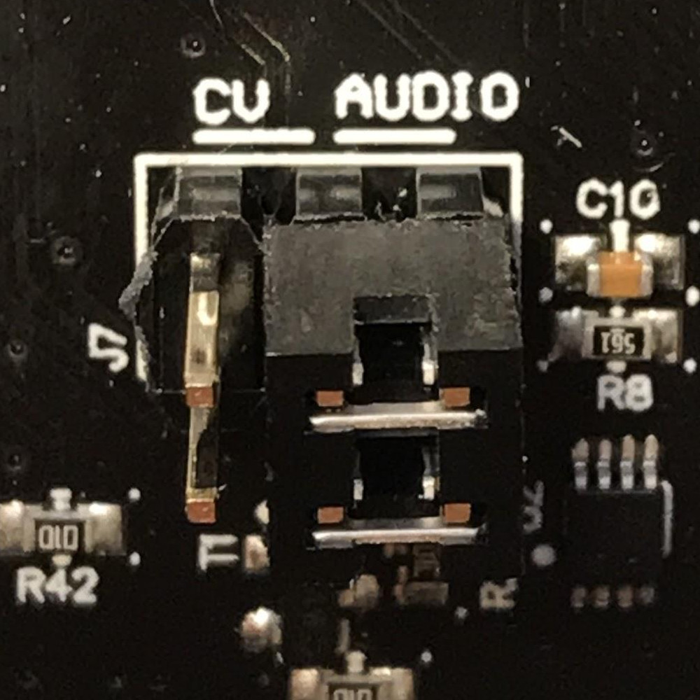
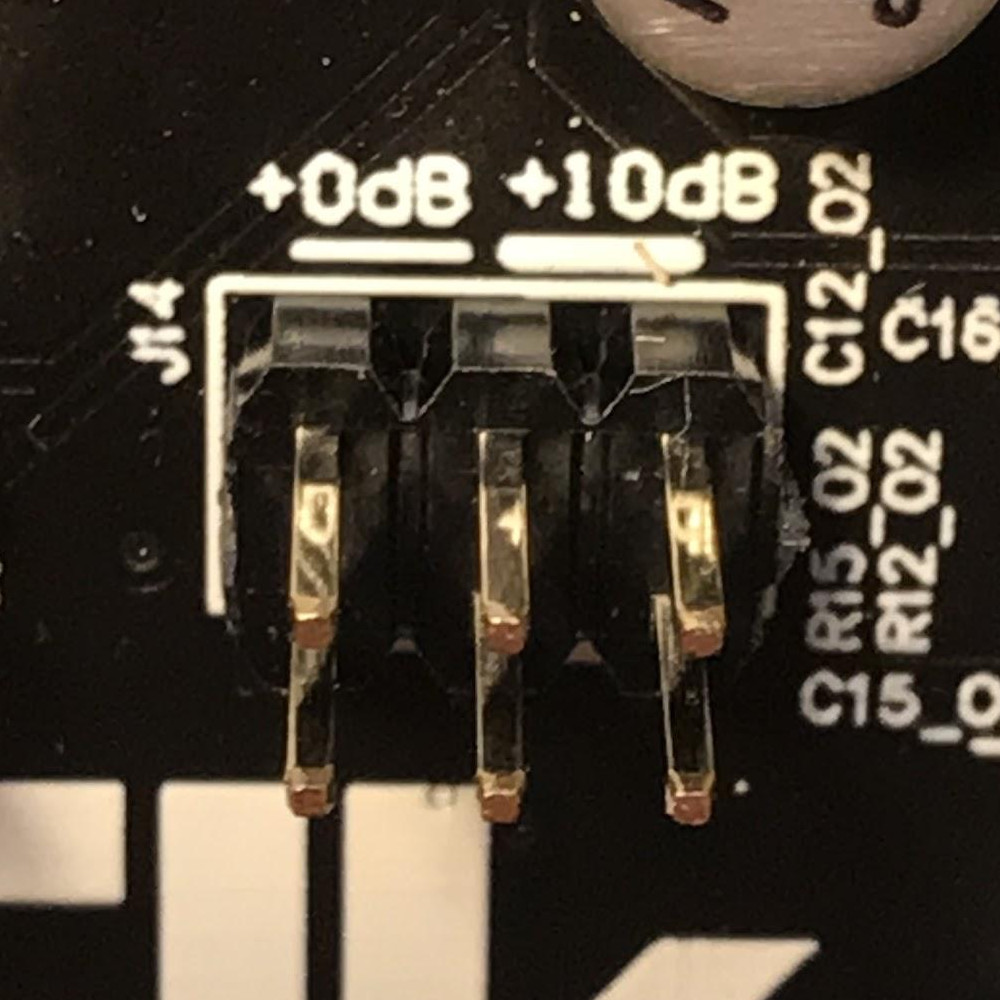
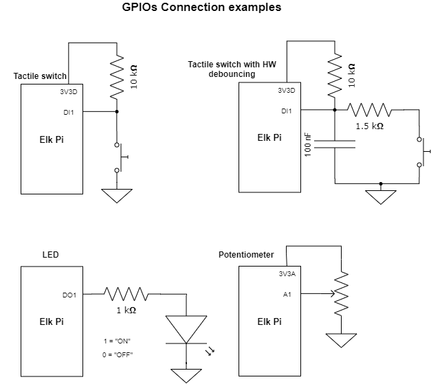
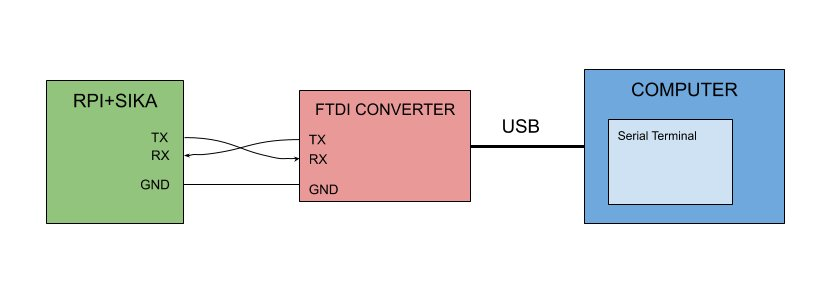
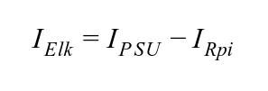

|image0|

**Author:** Elk

**Contact:** tech@elk.audio

**Revision:** G

**Last modification:** 2019-12-02

*DISCLAIMER*

**Copyright © 2019 Modern Ancient Instruments Networked AB. Modern
Ancient Instruments Networked AB** reserves the right to make changes to
this specification and its products at any time without notice. **Modern
Ancient Instruments Networked AB** assumes no liability arising out of
the application or use of any information, products or services
described herein. Customers are advised to obtain the latest version of
this device specification before relying on any published information
and before placing orders for products. **Modern Ancient Instruments
Networked AB** does not recommend the use of any of its products in
critical applications where the failure or may cause damage to property,
injury or death. Products are not authorized for use in such
applications.

Overview
========

Features
--------

-  Texas instrument PCM3168 audio codec, 24 Bit, 48 / 96 / 192 kHz

-  4 fixed analog audio inputs (2.54 mm pitch pin-header)

-  4 fixed analog audio outputs (2.54 mm pitch pin-header)

-  Headphone stereo output (3.5 mm Stereo Jack) w/ adjustable volume

-  Stereo Input jack (3.5 mm Stereo Jack)

-  2 fixed Control Voltage outputs (2.54 mm pitch pin-header)

-  2 Gate/Trigger inputs (2.54 mm pitch pin-header)

-  4 Gate/Trigger output (2.54 mm pitch pin-header)

-  2 configurable audio/CV inputs (2.54 mm pitch pin-header)

-  2 configurable audio/CV outputs (2.54 mm pitch pin-header)

-  16 analog sensor inputs (2.54 mm pitch pin-header)

-  32 digital inputs (2.54 mm pitch pin-header)

-  32 digital outputs (2.54 mm pitch pin-header)

-  5-poles DIN MIDI In/Out (2.54 mm pitch pin-header)

-  1 I2C interface (2.54 mm pitch pin-header)

Assembly content and accessories
--------------------------------

+-------------------------------------------------+---------+---------------------------------+----------------------------------------------------------------------------------------------------------------------+
| **Item**                                        | **Q**   | **Manufacturer, Part Number**   | **Supplier**                                                                                                         |
+-------------------------------------------------+---------+---------------------------------+----------------------------------------------------------------------------------------------------------------------+
| Raspberry Pi Model 3B+                          | 1       | /                               | `Your local distributor <https://www.raspberrypi.org/products/raspberry-pi-3-model-b-plus/>`__                       |
+-------------------------------------------------+---------+---------------------------------+----------------------------------------------------------------------------------------------------------------------+
| Official Rpi Power adapter 5.1V 2.5A microUSB   | 1       | /                               | `Your local distributor <https://www.raspberrypi.org/products/raspberry-pi-universal-power-supply/>`__               |
+-------------------------------------------------+---------+---------------------------------+----------------------------------------------------------------------------------------------------------------------+
| microSD card 8/16/32 GB                         | 1       | /                               |                                                                                                                      |
+-------------------------------------------------+---------+---------------------------------+----------------------------------------------------------------------------------------------------------------------+
| Heat Sink for Raspberry Pi CPU                  | 1       | Adafruit, 3038                  | `Mouser <https://www.mouser.se/ProductDetail/Adafruit/3083?qs=sGAEpiMZZMuKfYsiLTIqmKSvFn1Bw19gHz0pRNuazWQ%3D>`__     |
+-------------------------------------------------+---------+---------------------------------+----------------------------------------------------------------------------------------------------------------------+
| 18 mm m-f spacer                                | 4       | M2113-2545-AL                   | Mouser                                                                                                               |
+-------------------------------------------------+---------+---------------------------------+----------------------------------------------------------------------------------------------------------------------+
| 5 mm f-f spacers                                | 4       | M1252-2545-AL                   | Mouser                                                                                                               |
+-------------------------------------------------+---------+---------------------------------+----------------------------------------------------------------------------------------------------------------------+
| M2.5x4 steel screw                              | 4       | Keystone 29300                  | Mouser                                                                                                               |
+-------------------------------------------------+---------+---------------------------------+----------------------------------------------------------------------------------------------------------------------+
| Shunt connector 4 pos                           | 5       | Samtec, SAM10619-ND             | Digikey                                                                                                              |
+-------------------------------------------------+---------+---------------------------------+----------------------------------------------------------------------------------------------------------------------+
| Jtag-USB cable [1]_                             | 1       | Digilent                        | `Digilent store <https://store.digilentinc.com/jtag-usb-cable/>`__                                                   |
+-------------------------------------------------+---------+---------------------------------+----------------------------------------------------------------------------------------------------------------------+

.. [1]
   Not needed for developing

For assembling the board, follow the steps in our guide for `getting started with Elk Pi Hardware. <getting_started_with_development_kit_elk_pi_hardware.html>`__

Raspberry Pi guidelines
-----------------------

The following guidelines must be followed when using the Raspberry Pi
with the *Elk Pi* board. We are not responsible for possible damages
caused to your Raspberry Pi computer.

-  Use the **Raspberry Pi 3 Model B+**.
       
-  Use the `official RPi power adapter <https://www.raspberrypi.org/products/raspberry-pi-universal-power-supply>`__ (5.1V, 2.5A),
   and follow the power instructions listen in the
   section “Power Requirements” of this document.

-  Apply the heat-sink on the Raspberry Pi CPU to avoid overheating
   damages (Figure 1).

-  Always “cold plug” the Elk Pi board on the Rpi to avoid short
   circuits due to a wrong connection (plug the Elk Pi first, then
   power on the RPi).

-  If adopting the alternative PSU method (Page 10) make sure provide
   **not more than 5.1V** and make sure to respect the polarity of
   J12 (Figure 5).

Connectors and pinout
---------------------

*Figure 5:*

|image5|

*Figure 6:*

|image6|

Status LEDs
-----------

Two of the Raspberry Pi GPIOS are directly wired to two general purpose
LEDs, labeled on the board as “STATUS”.

|image7|

+------------------+-------------+-------------------------+
| **Designator**   | **Color**   | **Raspberry Pi GPIO**   |
+------------------+-------------+-------------------------+
| D1               | Red         | Pin 32 (BCM 12)         |
+------------------+-------------+-------------------------+
| D2               | Green       | Pin 37 (BCM 26)         |
+------------------+-------------+-------------------------+

Power requirements
==================

Elk Pi is fully powered from the 5V pin header exposed on the Raspberry
Pi, so *no additional power supply is needed other than the Raspberry
Pi’ one*. Just plug the Elk Pi board on top of the Raspberry Pi, power
the Raspberry Pi, and the green “ON” LED (D5) will turn on. If this
doesn’t happen, you might be using an incorrect power supply. Otherwise,
the board is likely malfunctioning. Note that you can power the
Raspberry Pi before plugging the Elk Pi onto it, there is no functional
requirement related to this sequence, just make sure that the pins
correctly line up to avoid possible short circuits.

Recommended Power Supply
------------------------

The power supply that you will use to power the Rpi, has to have the
following specifications:

-  5 VDC

-  >=2.5 A

-  Micro USB plug

Because of the voltage drop that the power cable usually causes, **we
recommend using the official Raspberry Pi Power Supply available**
`here <https://www.raspberrypi.org/products/raspberry-pi-universal-power-supply/>`__.
Its 5.1V output and steady 2.5A guarantee proper power conditions for
the Elk Pi. For some power-efficient applications the Elk Pi may work
also if the Raspberry is powered from a less reliable power sources like
phone chargers, USB ports or power-banks, but always try to **avoid
using third-party power sources to minimize possible poor supply
conditions**.

Power Consumption
-----------------

The power consumption of the Elk Pi board highly depends on the usage of
the board or, in other words, what you connect to it.

Since the Elk Pi and the raspberry Pi share the same 5V source, the
current available for the Elk Pi to use is:

|image101|

It’s reported from many sources (`like this
one <https://www.pidramble.com/wiki/benchmarks/power-consumption>`__)
that the Raspberry Pi can draw at maximum around 1A of current with a
400% CPU stress test, so the Elk Pi will have at least 1.5 A to
function, and this will be enough current in most use cases.

Idle Power consumption on 5V pin (Elk Pi only) = 200 - 300 mA

Idle Power consumption on 5V pin (Elk Pi+Rpi) = 800 - 950 mA

Alternative Power Supply
------------------------

In the standard configuration, the Elk Pi is taking the power from the
5V pin of the raspberry Pi, which is directly coming from the micro USB
power supply. However, it is also possible to have a different power
configuration, where the power is provided from an external source
through the pins of J12 of the Elk Pi board (refer to Figure 4).

In this case, the Elk Pi is powering the Raspberry Pi through the
external source connected to J12. **Do not use the alternative power
supply (J12) if the Raspberry Pi is powered from its micro USB PSU (and
viceversa).** Only one power source must provide power to the system.
This alternative power method is intended for special use cases where is
not practical to have the default microUSB power supply. The power
requirement is, clearly the same stated previously: 5V, 2.5A.

Audio/CV configurations
=======================

One of the Elk Pi main features is its audio/cv configurability. The
board has a total of 6 inputs and 8 output channels. A total of 4
channels, two for the Inputs and two for the outputs, are individually
configurable to work for either CV or Audio signals. *Figure 6* below
illustrates the possible configurations:

*Figure 7:*

|image102|

As you can see from *Figure 7*, there are two mode-switches for the
input and two for the output. The switches are implemented using
standard 2x3 pin headers in combination with a dual jumper connector.
Move the dual jumper connector of the respective header (J7, J8, J10,
J11) as shown in Figure 7 to switch between CV or audio functionality of
the channel. Every header refer to a single channel and when, for
example, the switch is set to “Audio”, the respective CV pin will not be
functioning, so **be sure to match the CV/Audio configuration of your
board, with the actual pins you will be using.** **If the dual jumper is
removed and no electrical connection is made on the header, the channel
will not work at all, you must keep the dual jumper either to select
“Audio” or “CV”.** Finally, make sure that the dual jumper is properly
is oriented with the connections parallel to the long side of the header
(Figure 8).

*Figure 8:*

+-----------------------------------------+-----------------------------------------+-----------------------------------------+
| |image9|                                | |image10|                               | |image8|                                |
|                                         |                                         |                                         |
|   *CV Selected*                         |   *Audio Selected*                      |   *BAD CONNECTION*                      |
+-----------------------------------------+-----------------------------------------+-----------------------------------------+

Audio I/O
=========

The board presents a maximum of 6 audio inputs (if J7 and J8 are on
“audio” configuration) and 6 audio outputs (if J10 and J11 are on
“audio” configuration). The first two input channels are high impedance
and fed into a +10 dB preamp for guitar/bass inputs. (check the chapter
“Stereo preamp” for further information)

+---------------------------------------------------------+-----------+
| Input Impedance Ch 1,2                                  | 1 MΩ      |
+---------------------------------------------------------+-----------+
| Input Impedance Ch 3,4,5,6                              | 122 kΩ    |
+---------------------------------------------------------+-----------+
| Max Input signal amplitude (all channels, preamp OFF)   | 5 Vpp     |
+---------------------------------------------------------+-----------+
| Max Input signal amplitude (Ch1, 2 , preamp ON)         | 1.5 Vpp   |
+---------------------------------------------------------+-----------+
| Line output Impedance (all channels)                    | 47 Ω      |
+---------------------------------------------------------+-----------+
| Max output voltage (all channels)                       | 4 Vpp     |
+---------------------------------------------------------+-----------+

The Codec `Texas Instruments
PCM3168 <http://www.ti.com/lit/ds/symlink/pcm3168a.pdf>`__, supports 6
input channels and 8 output channels at 24 bit, at 48kHz. Since the
Raspberry Pi SOC natively supports only 2 channels, a CPLD is introduced
between the Codec and the Raspberry Pi to achieve multi-channel support.

**Important Note:** Input channel 1 (RING) and 2 (TIP) shall be
accessed through the input stereo Jack J13. If you desire, instead, to
use the pins to connect audio to channel 1 and 2 (pin 11 and pin 12 on
J4), you will need to remove the ground protection introduced from J13
that would be automatically removed once a stereo minijack is used to
provide the signal. To do this, you have two options:

1. Connect a “dummy” stereo mini jack to J13 (recommended).

2. Desolder J13.

If you use the pins as your input source for channel 1 and/or 2 and
neither of the two options is applied, the channel/s will be muted.

Eurorack Compatibility
----------------------

The Elk pi board is designed to be interfaceable with the Eurorack world
thanks to its CV and Gate capabilities. However, the audio levels are
not directly compatible with the Eurorack standards. Audio signals
coming from a Eurorack system, can be very loud (typically 10 Vpp), so
make sure that all the inputs signals are brought to line level (max
5Vpp) before feeding them to the Elk Pi. **Do not feed output from
oscillators directly to the Elk Pi board.**

If you desire to build an Eurorack module based on the Elk Pi with audio
input and output, you will need to make sure to attenuate the input
signal before feeding it to the board, (for example with an attenuator
module). The line level output might sound a bit weak in a eurorack
system, but this is less concerning since it is likely to find source of
gain in your signal path (in the worst case, from your output module).

Mini-jack input
---------------

A 3.5 mm stereo jack input (J13) is present on the board. This is
directly connected to input channels 1 (RING) and 2 (TIP). The same two
inputs are also reported on the pin headers like the rest of the
channels. The function of the jack is to be able to get some signals
into the board without having to design a hat for the Elk Pi, which is
required to access most of the I/O on the board. Since channel 1 and 2
of the board goes through the preamp, it is also possible to connect an
instrument-level signal into it, using a mini-jack to mono jack
splitter.

Stereo Preamp
-------------

The board has a two-channel preamp with a fixed gain of +10dB (3.16
times). **The preamp is only available on channels 1 and 2 and it can be
activated or deactivated through the mode switch J14,** in the same
fashion of the CV/Audio mode switch explained earlier. Note that in this
case, differently from theCV/Audio switch mechanism, if the header is
left open (without dual jumper plugged) the preamp is activated. Also in
this case a bad connection is established when the dual jumper is not
properly oriented, refer to Figure 9 for good connections examples.

*Figure 9:*

+-----------------------------------------+-----------------------------------------+-----------------------------------------+
| |image12|                               | |image13|                               | |image11|                               |
|                                         |                                         |                                         |
|   *+0dB Selected*                       |   *+10dB Selected*                      |   *+10dB Selected*                      |
+-----------------------------------------+-----------------------------------------+-----------------------------------------+

For normal line-level input signals, the preamp amplification is most
likely not needed, so you may want to configure J14 on 0dB mode if you
are feeding a line-level signal, otherwise, clipping might occur.

If you are feeding an instrument-level signal (coming from a guitar or
bass for example) you definitely want to switch J14 on +10dB mode, to
boost the input.

Note: when the preamp is +0dB mode, the audio level of ch. 1 and 2 is
approximately 0.3dB higher with respect audio channel 3, 4, 5 and 6, due
to its high impedance.

Headphones output
-----------------

The output channel 1 and 2 of the Codec are also available on the
headphone jack J5 (L = Ch 1, R = Ch2).

Max output power to each channel:

    150 mW @ 16 Ω

    90 mW @ 32 Ω

    50 mW @ 64 Ω

Since the headphone and line-out share the same output filter from the
codec, the input signal into the headphone amplifier might be affected
by the heavy loads connected to the line-out jack. Be aware that by
short-circuiting the right channel (by using mono 6.3 mm to RCA plug for
example) the right channel will be muted on the headphones. You can
adjust the volume of the headphone output by means of the rotary
potentiometer R50. The volume is increased with a clockwise rotation.

Analog and Digital GPIOs
========================

Digital IO
----------

Digital IO is based on shift registers. Namely 74HC165 for input and
74HC595 for output. Logic level for both is 3.3V and exceeding it will
damage the whole GPIO subsystem permanently since the shift registers
are daisy chained. The inputs do not have any pullup- or pulldown
resistors! All inputs are captured simultaneously by toggling the
parallel load input of all input shift registers. Similarly all outputs
are written concurrently on the rising edge of the storage register
clock input.

+----------------------------------------+-----------------------------------------------------------+
| Input type                             | 3.3V CMOS (without pull-up or pull-down resistors)        |
+----------------------------------------+-----------------------------------------------------------+
| Input logic high level                 | >1.5 V                                                    |
+----------------------------------------+-----------------------------------------------------------+
| Input logic low level                  | <0.5 V                                                    |
+----------------------------------------+-----------------------------------------------------------+
| Output type                            | 3.3V CMOS (push & pull)                                   |
+----------------------------------------+-----------------------------------------------------------+
| Max sink & source current per output   | 4 mA                                                      |
+----------------------------------------+-----------------------------------------------------------+
| Read/Write frequency                   | Max 1 kHz (depends on SW configuration)                   |
+----------------------------------------+-----------------------------------------------------------+

32 Digital inputs (DIx) and 32 Digital outputs (DOx) are available on
the 40-pins male connectors J3 and J4 (refer to pinout). They shall be
used to connect buttons, switches, rotary encoders, rotary switches,
LEDs, LED rings, etc..

Analog Inputs
-------------

The analog inputs are based on one single channel 10-bit analog to
digital converter ADS70411 and an analog multiplexer 74HC4067. The
multiplexer is controlled by a single shift register that shares the
same SPI bus as digital GPIO but has dedicated storage register input
from the MCU. Only one channel can be read simultaneously by enabling
certain multiplexer and selecting desired channel.

+---------------------------------------+-------------------------------------------+
| Input voltage range relative to GND   | 0V - 3.3V                                 |
+---------------------------------------+-------------------------------------------+
| Input impedance                       | 600 kΩ                                    |
+---------------------------------------+-------------------------------------------+
| Sampling frequency                    | Max 1 kHz (depends on SW configuration)   |
+---------------------------------------+-------------------------------------------+

16 Analog inputs are (Ax) are available on the 26-pins male connector J6
(refer to pinout). They shall be used to connect potentiometers, sliders
and sensors.

Connection guidelines for GPIO peripherals
------------------------------------------

Inputs and outputs of multi-pin peripheral device must be sequential
for the ease of software development. A perfect example would be
individual bits of an LED-ring situated around a rotary encoder.
The LEDs in this case should be connected to DO0...DOn in a way
that DO0 connects the first and DOn the last LED in the ring.
While it is not mandatory to start from DO0, it is very important
to keep outputs sequential. If multiple LED rings are
multiplexed, the common control signal of individual rings should
be also kept sequential and placed at the start or to the end of
the LED control pins.

The pins **3V3A** and **3V3D** shall be used as supply source for,
respectively, **analog** inputs and **digital** I/O.

**All the GPIOs are 3.3V compatible (not 5V compatible)**.

Current sink and source from digital outputs should be kept lower than 4 mA per pin.

Use as reference the examples illustrated in the diagram below:

|image14|

CV & GATE I/O
=============

CV I/O
------

Up to two CV inputs and four CV outputs are available on the board
(refer to *Figure 4* to understand the possible configurations). The CV
signals are processed using the same codec used for the audio. Note that
the Input HPF of the last two input channels of the codec are
deactivated by default to make the CV processing possible. The CV inputs
signals are sampled at the same frequency of the audio (48kHz), but they
are downsampled in software, so the effective sampling rate depends on
the buffer size. CV inputs that exceed the input range are clipped.

+---------------------------+----------------------------------------------------+
| Input dynamic range:      | -5 : +5 V                                          |
+---------------------------+----------------------------------------------------+
| Input impedance           | 122 kΩ                                             |
+---------------------------+----------------------------------------------------+
| Input polarity            | Inverting [2]_                                     |
+---------------------------+----------------------------------------------------+
| CV Sampling frequency :   | 48 kHz/buffer size (depends on SW configuration)   |
+---------------------------+----------------------------------------------------+
| Output dynamic range:     | 0 : 10 V                                           |
+---------------------------+----------------------------------------------------+
| Output impedance          | 47 Ω                                               |
+---------------------------+----------------------------------------------------+
| Output polarity:          | Non Inverting                                      |
+---------------------------+----------------------------------------------------+

.. [2]
   Electrically it is an Inverting input, but the signal is corrected in SW
   to be non inverting.

GATE I/O
--------

Two gate inputs and four gate outputs are available on the board. The
input stage is inverting and is based on a transistor high-side switch
linked directly to a Raspberry Pi GPIO. The outputs are not inverting
and generated from four different Raspberry Pi GPIO and a series CMOS
buffer. Note that the gate IO pins can be also used as a trigger or
clock IOs, depending on the software configuration.

+-----------------------------+--------------------------+
| Input High voltage range    | >= 0.8 V                 |
+-----------------------------+--------------------------+
| Input Low voltage range     | < 0.7 V                  |
+-----------------------------+--------------------------+
| Input Sampling frequency    | Depends on buffer size   |
+-----------------------------+--------------------------+
| Input polarity              | Inverting [3]_           |
+-----------------------------+--------------------------+
| Output “High” voltage       | 5V                       |
+-----------------------------+--------------------------+
| Output “Low” voltage        | 0V                       |
+-----------------------------+--------------------------+
| Max output source current   | 6 mA                     |
+-----------------------------+--------------------------+
| Output polarity             | Non inverting            |
+-----------------------------+--------------------------+

.. [3]
   Electrically it is an Inverting input, but the signal is corrected in SW
   to be non inverting.

UART interface
==============

The UART interface can be accessed using the pins 32, 34, 36, 38, 39 of
J4 (Figure 10), that are labeled as “MIDI” since they are the same pins
that can be used to connect the MIDI 5 Poles DIN connectors. For this
reason the UART cannot be used if the dedicated pins are connected to
the MIDI DIN connectors.

*Figure 10:*

|image15|

As you can see from Figure 10, to use the UART you must short (with a
female to female jumper) pin [36] and pin [32]. Pin [38] will be UART TX
and pin [34] will be UART RX. Figure 11 illustrates how to connect the
Elk Pi to your computer with a TTL to USB connector (FTDI).

*Figure 11:*

|image100|

MIDI DIN I/O
============

Elk Pi has Optocoupled MIDI IN and MIDI OUT built in, so it is possible
to interface it with 5 pins DIN connectors. You might want to do this
when you will build your own User interface to plug on top of the Elk
Pi. The MIDI signal can be found on the connector J9 (refer to Figure 11
and Figure 5). On the following table you can see some guidelines on how
to make the connections:

+----------------+-----------------+-----------------+-----------------------------------+
|                | **Pin on J4**   | **Pin Label**   | **Pin on DIN socket**             |
+----------------+-----------------+-----------------+-----------------------------------+
| **MIDI IN**    | 32              | MIDI IN 4       | 4                                 |
+----------------+-----------------+-----------------+-----------------------------------+
|                | 34              | MIDI IN 5       | 5                                 |
+----------------+-----------------+-----------------+-----------------------------------+
|                | 31/33/39...     | GND             | 2                                 |
+----------------+-----------------+-----------------+-----------------------------------+
| **MIDI OUT**   | 36              | MIDI OUT 4      | 4                                 |
+----------------+-----------------+-----------------+-----------------------------------+
|                | 38              | MIDI OUT 5      | 5                                 |
+----------------+-----------------+-----------------+-----------------------------------+
|                | 31/33/39...     | GND             | 2                                 |
+----------------+-----------------+-----------------+-----------------------------------+

|image16|

Board dimensions
================

|image17|

.. |image0| image:: ./illustrations/datasheet_images/image27.jpg
.. |image1| image:: ./illustrations/datasheet_images/image25.jpg
   :width: 500 px
.. |image2| image:: ./illustrations/datasheet_images/image14.jpg
   :width: 500 px
.. |image3| image:: ./illustrations/datasheet_images/image17.jpg
   :width: 500 px
.. |image4| image:: ./illustrations/datasheet_images/image26.jpg
   :width: 500 px
.. |image5| image:: ./illustrations/datasheet_images/image16.jpg
.. |image6| image:: ./illustrations/datasheet_images/image13.jpg
.. |image7| image:: ./illustrations/datasheet_images/image28.jpg
   :width: 500 px
.. |image8| image:: ./illustrations/datasheet_images/image21.jpg
   :width: 200 px
.. |image9| image:: ./illustrations/datasheet_images/image22.jpg
   :width: 200 px

.. |image12| image:: ./illustrations/datasheet_images/image20.jpg
   :width: 200 px
.. |image13| image:: ./illustrations/datasheet_images/image24.jpg
   :width: 200 px

.. |image15| image:: ./illustrations/datasheet_images/image6.jpg
.. |image16| image:: ./illustrations/datasheet_images/image12.png
   :width: 200 px
.. |image17| image:: ./illustrations/datasheet_images/image11.jpg

.. |image102| image:: ./illustrations/datasheet_images/image102.jpg
