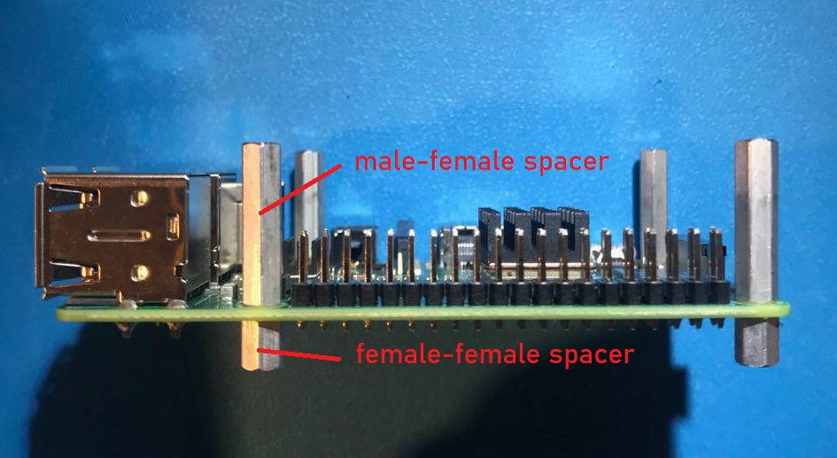

# Elk Pi Hardware

Get Started with the Elk Pi Hardware.

This document contains basic information on how to set up Elk Pi development boards. See also the relevant [datasheet for your Elk Pi Board](../../../Elk_Pi_Datasheet.pdf), for information on the hardware layout of the board.

## 1. Assembly

1. Mount the four f-m spacers into the f-f spacers on the Raspberry Pi (*Figure 1)*



2. Plug the Hat on top of the Raspberry Pi (*Figure 2*).

   

3. Add the four screws if you want extra stability (*Figure 3).*


## 2. Flashing the Elk operating system image to the SD card

To get the system running, you need to flash an Elk operating system image onto an SD card and plug it into the Raspberry Pi. A minimum 8GB card is required

1. Download the compressed image from the provided link. It will have a filename such as: *elk-sika-image-dev-raspberrypi3-64.wic.bz2*.

2. Connect the empty SD card to a computer. If you do not have a computer with an SD/Micro-SD card reader, you will need a USB adapter.

### Windows:

   1. Extract the `.wic` file from the `.bz2` archive using [7Zip](https://www.7-zip.org/download.html) or another compression utility

   2. Download and install [balenaEtcher](https://www.balena.io/etcher/), or [Win32DiskImager](https://www.raspberrypi.org/downloads/).
   
   3. Flash the extracted `.wic` file to the SD card.

### Linux
At your convenience, you can either use [balenaEtcher](https://www.balena.io/etcher/), or use plain `dd` with these instructions:

   1. Find out under what name your SD card is listed on your computer, using e.g. `lsblk -f`. On modern Linux distributions it usually is`/dev/sdb` ,`/dev/sdc`, or following letters, or sometimes `/dev/mmcblk0`. We will refer to it as `/dev/sdX` in the following.
   
   2. Unmount the SD card if it was already mounted:

   ```bash
     $ sudo unmount /dev/sdX*
   ```

   3. **VERY IMPORTANT: double-check that you are using the correct device with dd! Otherwise you could risk wiping out another disk on your machine!** To uncompress and flash onto the SD card run :
      
   ```bash
      $ bzcat elk-sika-image-dev-raspberrypi3-64.wic.bz2 | sudo dd of=/dev/sdX bs=4M status=progress && sync
   ```


   4. The process can take a few minutes, so this is a good time to stretch your legs.

      If for any reason the process fails, just reduce the `bs=4M` speed to `bs=1M` for example, and it should work great.

### macOS:

   Also here you can flash the image using [balenaEtcher](https://www.balena.io/etcher/), using Unarchiver to extract the `.bz2` file first.

## 3. Power up, and next steps

1. Put the SD card in the corresponding slot on the Raspberry Pi.
2. Connect the power supply Micro-USB cable to the Raspberry Pi - it will boot into Linux.

From here on, the steps for connecting, and getting sound output, are the same for all our boards. These are detailed in [Run Elk on Development Kit Hardware (common for all boards)](get_first_sound_from_devkit_board.md).
