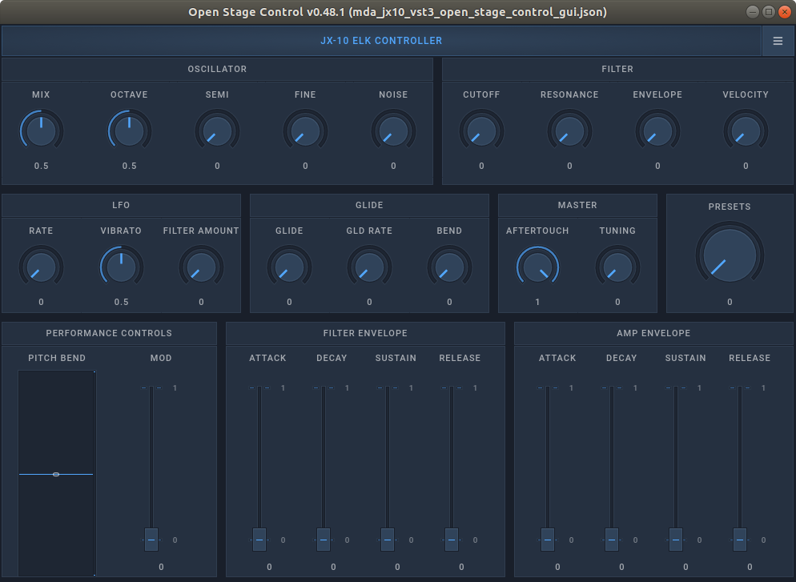
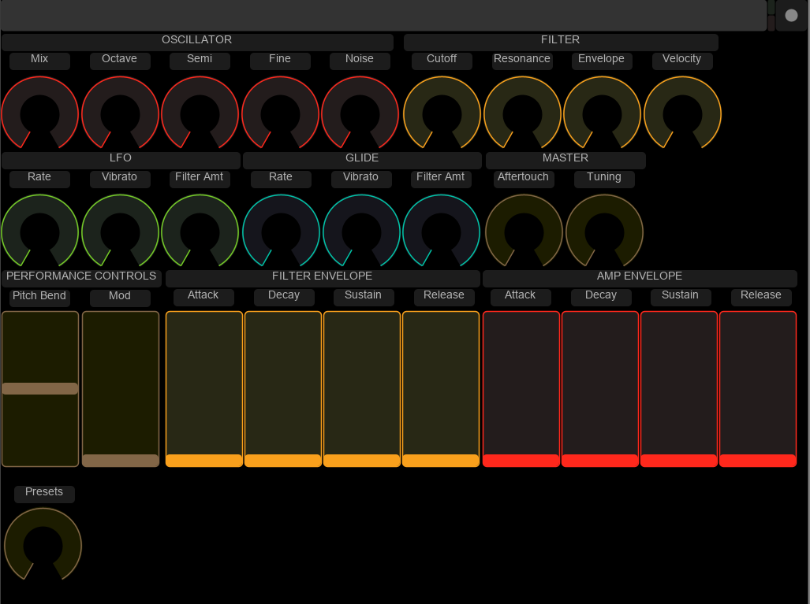

# Development Kit Software
In this guide you will quickly see which the first steps are, to run a plugin from within Elk's Sushi host, to get sound playing out of it, and to control its parameters using an Open Sound Control (OSC) GUI.

**IMPORTANT:** All the below instructions and example files, are written for the context of running on a Linux desktop environment, not our development boards, for which the paths, binary files and command line arguments will differ. Refer instead to our [instructions for running on the boards](run_elk_on_boards.md).

## Running a plugin within the Sushi host

You could run Sushi natively on your own Debian Linux computer, or on a virtual machine. To get started you need the Sushi AppImage, available from the [Releases section of our Sushi repository](https://github.com/elk-audio/sushi/releases). Read [these brief instructions if you are unfamiliar with running software in Linux AppImages](https://itsfoss.com/use-appimage-linux/).

To output sound, you need to have Jack audio configured on your computer, which is beyond the scope of this guide - but if you have trouble getting it working [definitely ask us on the forum](https://forum.elk.audio) and we'll do our best to get you going! We here show how use [Cadence and Catia for managing Jack](https://kx.studio/Repositories#Ubuntu), but you can use any other tools you prefer in their place.

## Starting Sushi with the MDA JX10 VST synthesizer

First we assume you are able to run Sushi and connect to Jack audio.

The example used, requires that you have these files from the  our [elk-examples repository](https://github.com/elk-audio/elk-examples/tree/master/mda_jx10_vst3):

1. config_play_vst3.json - the Sushi configuration file.
2. mda_jx10_vst3_open_stage_control_gui.json - the Open Stage Control GUI.
3. [mda-vst3.vst3.tar.xz](https://github.com/elk-audio/elk-examples/releases/download/examples_01/mda-vst3.vst3.tar.xz) - an x86 build of the MDA plugins, containing also the JX10 Synthesizer binary.
4. (optionally) mda-vst3-touchosc-gui.touchosc, to control JX10 from the [TouchOSC app](https://hexler.net/products/touchosc).

First unpack the tar-file with the plugin to your local drive. Place the contained VST3-plugin folder in the default path expected: `/usr/lib/VST3/mda-vst3.vst3`. If you place the mda-vst3.vst3 extracted content elsewhere, you also need to edit the config_play_vst3.json to refer to that new path.

To run Sushi using Jack, with the configuration file provided for running the MDA JX10 VST3 synthesizer: 

1. Navigate to `/the/folder/where/you/have/placed/sushi` in a console window.

2. Type the following command:

```bash
$ ./Sushi-x86_64-0.7.0.AppImage -j --connect-ports -c /path/to/example/config/files/config_play_vst3.json
```

You should see the following status message:

```bash
SUSHI - Sensus Universal Sound Host Interface
Copyright 2016-2019 Elk, Stockholm
```

3. Sushi should also appear as an audio device in your Jack configuration software - see the Catia screenshot below for an example:


​  
Note that its outputs are already connected.

That is because the `--connect-ports` command-line option used, attempts to connect the Sushi outputs. If they are not connected after running Sushi, you need to make these connections yourself, or you will not be able to hear any sound.

If you were to instead run Sushi on the Development Kit Board, you should use the following command, this time using the `-r` switch for selecting the RASPA low-latency front-end instead of Jack:

```bash
$ sushi -r -c /relative/path/to/your/config.json
```

## Connecting MIDI to Sushi

Now, although Sushi is successfully running and hosting the MDA jx10 vst3 synthesizer plugin, you will need to connect it to a MIDI device to be able to play sound. For this, connect them with the `aconnect` tool:

1. Start a new terminal window than the one where Sushi is running.
2. Type `'aconnect -l'` to list all available MIDI devices and ports for connections:

```bash
client 0: 'System' [type=kernel]
    0 'Timer           '
    1 'Announce        '
client 14: 'Midi Through' [type=kernel]
    0 'Midi Through Port-0'
    1 'Midi Through Port-1'
    2 'Midi Through Port-2'
    3 'Midi Through Port-3'
client 24: 'UA-22' [type=kernel,card=2]
    0 'UA-22 MIDI 1    '
client 28: 'Launchkey MK2 25' [type=kernel,card=3]
    0 'Launchkey MK2 25 MIDI 1'
    1 'Launchkey MK2 25 MIDI 2'
client 128: 'Sushi' [type=user,pid=20167]
    0 'listen:in       '
    1 'write:out       '
```

3. The output you see will vary depending on your configuration, you should take note of the port number X for your MIDI controller (e.g. 28) and the one Y assigned to Sushi, here 128. 

4. By typing `aconnect X Y`, or in this example `aconnect 28 128`, you should now hear sound when playing on your keyboard. 

Tip: If you do not have a physical keyboard available, you can use the ***Virtual MIDI Piano Keyboard*** software (VMPK).

## Control MDA JX10 VST3 plugin with Open Stage Control

If you do not know what Open Sound Control (OSC) is, it is helpful (but not mandatory) [if you first read the article on the Elk Tech blog, dedicated to the topic](https://elk.audio/controlling-plug-ins-in-elk-part-i/).

1. Download and install the free [Open Stage Control](https://openstagecontrol.ammd.net/) application to your computer.

2. Upon starting it, you will see the screen below. Here, all you need to do, is enter the IP and Port number, as is displayed under 'send' below. If you run the software on the same computer as you run Sushi, the IP should remain 127.0.0.1, and if you have not changed the Sushi default configuration, Sushi's Port should remain 24024.

   
​  
   
   3. Click Start, and subsequently 'Browse...', to navigate to the path where "mda_jx10_vst3_open_stage_control_gui.json" is available.
   4. You will now see the GUI below for controlling the jx10 synthesizer:

 
​  

5. Assuming everything is correctly configured, the controls on the screen will send OSC messages to to the jx10 synth via Sushi, altering its parameters.

For example, dragging the knob 'Resonance', will send the point value of the knob to the OSC address  '/parameter/jx10/VCF_Reso'. 

'jx10' is here the name given the plugin in the Sushi configuration file. 

**Note:** If you choose to change that name ('jx10'), the Open Stage Control template is easily updated by enabling editing, clicking on the "JX-10 ELK CONTROLLER"-title, and then, in the 'osc'-section of the editor, setting the 'address' field to "/parameter/your_synth_name", instead of the current "/parameter/jx10".

### Control MDA JX10 VST3 plugin with TouchOSC

If you would prefer to control your plugin from an iPad/Android tablet, we have also created an example GUI using the [TouchOSC software](https://hexler.net/touchosc) - the file named `mda-vst3-touchosc-gui.touchosc`.

To use it, please refer to the TouchOSC manual - the only customisation needed is setting the IP-address that your computer running Sushi is using, in your TouchOSC app's settings.



Which OSC messages your particular configuration responds to, can be accessed by running Sushi with the `--dump-plugins` flag, as detailed in our [detailed documentation for Sushi](sushi_overview.md).
