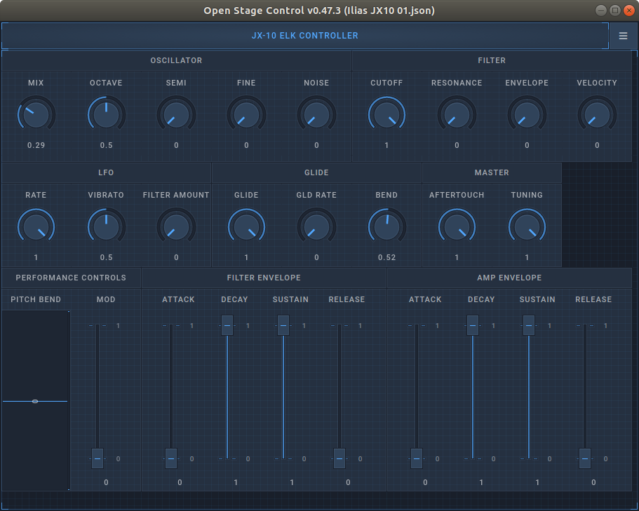

# Getting Started With ELK Development Kit

## Overview

Here you will quickly see which the first steps are, to run a plugin from within ELK's SUSHI host, to get sound playing out of it, and to control its parameters using an Open Sound Control (OSC) GUI.

### Running a plugin within the SUSHI host

Log in as mind user to the Virtual Machine.

Ensure that you have audio playback configured correctly for the virtual machine to play audio over JACK or RASPA on your computer.

#### Starting SUSHI with the MDA jx10 vst synthesizer

To run SUSHI using JACK, and a configuration file provided by us for running the MDA JX10 vst2 synthesizer: 

1. Navigate to the `/workspaces/sushi/build/debugWithTests` folder in a console window.

2. Type the following command:

```bash
$ ./sushi -j --connect-ports -c ../../misc/config_files/config_play_LV2_jx10.json
```

You should see the following status message:

```bash
SUSHI - Sensus Universal Sound Host Interface
Copyright 2016-2018 MIND Music Labs, Stockholm
```

3. Sushi should also appear as an audio device in your JACK configuration software - see below the Catia screen as an example:


Note that its outputs are already connected.

That is because the `--connect-ports` command-line option used, attempts to connect the SUSHI outputs. If after running they are not connected, you need to make these connections yourself, or you will not be able to hear sound.

To invoke SUSHI with the the RASPA low-latency front-end instead, replace the `-j`  switch with `-r`:

```bash
$ sushi -r -c /path/to/your/config.json
```

#### Connecting MIDI to SUSHI

Now, although SUSHI is successfully running and hosting the MDA jx10 vst2 synthesizer plugin, you will need to connect it to a MIDI device to hear sound. For this, connect them with the `aconnect` tool:

1. Start a new terminal window than the one where SUSHI is running.
2. Type `'aconnect -l'` to list all available MIDI devices and ports for connections:

```bash
client 0: 'System' [type=kernel]
    0 'Timer           '
    1 'Announce        '
client 14: 'Midi Through' [type=kernel]
    0 'Midi Through Port-0'
    1 'Midi Through Port-1'
    2 'Midi Through Port-2'
    3 'Midi Through Port-3'
client 24: 'UA-22' [type=kernel,card=2]
    0 'UA-22 MIDI 1    '
client 28: 'Launchkey MK2 25' [type=kernel,card=3]
    0 'Launchkey MK2 25 MIDI 1'
    1 'Launchkey MK2 25 MIDI 2'
client 128: 'Sushi' [type=user,pid=20167]
    0 'listen:in       '
    1 'write:out       '
```

3. The output you see will vary depending on your configuration, you should take note of the port number X for your MIDI controller (e.g. 28) and the one Y assigned to Sushi, here 128. 

4. By typing `aconnect X Y`, or for this example `aconnect 28 128`, you should now hear sound when playing on your keyboard. 

Tip: If you do not have a physical keyboard available, you can use the ***Virtual MIDI Piano Keyboard*** software (VMPK).

#### Controlling the MDA jx10 plugin over Open Sound Control

If you do not know what Open Sound Control (OSC) is, it is helpful - but not mandatory - [if you first read the article on the MIND Music Labs Tech blog, dedicated to the topic](https://www.mindmusiclabs.com/controlling-plug-ins-in-elk-part-1-open-sound-control/).

1. Download and install the free [Open Stage Control](https://openstagecontrol.ammd.net/) application to your computer.

2. Upon starting it, you will see the screen below. Here, all you need to do, is enter the IP and Port, as is displayed under 'send' below. If you run the software on the same computer as you run SUSHI, the IP should remain 127.0.0.1, and if you have not changed the SUSHI default configuration, the Port should remain 24024.

   

   3. Click Start, and subsequently 'Browse...', to navigate to the path where the "JX10 ELK Controller.json" is available.
   4. You will now see the below GUI for controlling the jx10 synthesizer:



5. Assuming all is correctly configured, the controls on the screen will send OSC messages to to the jx10 synth via SUSHI, altering its parameters.

For example, dragging the Knob 'Resonance', will send the floating point value to the OSC address  '/parameter/Synth/VCF_Reso'. 'Synth' is here the name given the plugin in the SUSHI configuration file. 

Note: If you choose to change that name, the Open Stage Control  template is easily updated by  enabling editing, clicking on the "JX-10 ELK CONTROLLER"-title, and then, in the 'osc'-section of the editor, setting the 'address' field to "/parameter/your_synth_name", instead of the current "/parameter/Synth".